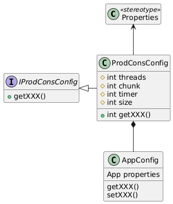

##  Configuracion

Aparte de los datos de configuracion necesarios para **CRON** como gestor general
responsable de ir arrancando las tareas a intervalos prefijados
y de los propios de la tarea a ejecutar, se necesitan los siguientes parametros
para configurar el entorno:

- **threads**: Numero de hilos a gestionar
- **chunk**: Numero de procesos a realizar antes de persistir a la base de datos
- **lote**: Numero maximo de elementos a procesar en una sesion de la tarea
- **timer**: Opcional. maximo tiempo de ejecucion de la tarea en segundos

Asi pues, el archivo de configuracion de la tarea debe extender del archivo de configuración
de la libreria, considerando que:

- La libreria utiliza/ve la configuracion que le es propia
- La tarea utiliza/ve sus propios datos de configuracion

### Ejemplo:
Supongamos los siguientes valores:

threads = 5 
chunk = 50 
lote = 500

Cada vez que se ejecute la tarea: 

1. Se crearan cinco hilos para consumir
2. El productor leera un maximo de 500 elementos de la fuente
3. *Idealmente*, cada hilo procesará 100 (500 / 5) elementos
4. Cada vez que un hilo haya procesado 50 elementos realizará un commit

La tarea acabará cuando se hayan procesado todos los elementos o cuando se
alcance el tiempo maximo de ejecucion. Lo que suceda primero

> En un entorno en el que una tarea se ejecuta cada x minutos, y sin mayor información  
> al respecto, el ***timer*** se encarga de monitorizar el tiempo transcurrido y notificar a los hilos  
> que acaben de una ***forma controlada*** antes de que se cumpla el plazo establecido  
> en previsión de que, en función del "planificador", se solapen tareas
