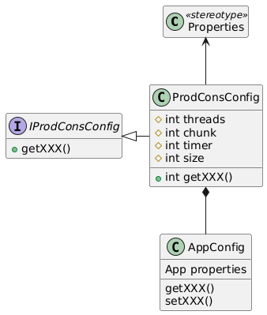
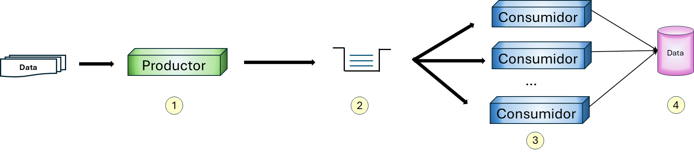

# Productor / Cosumidor

@include:./cap01.md

Paquete que encapsula la ejecucion de "*tareas programadas*" implementando el paradigma <b>productor/consumidor</b> por colas de memoria
en un entorno multihilo

Una tarea que desee adherirse a este modelo debe implementar, ademas del proceso que ejecuta el **cron**:

1. Un fichero de configuracion/propiedades que implemente IProdConsConfig
2. Una clase "procesadora". Responsable de obtener la informacion a procesar
3. Una clase "consumidora". Responsable de procesar <b>un</b> item de esa informacion

##  Configuracion

Aparte de los datos de configuracion necesarios para **CRON** como gestor general
responsable de ir arrancando las tareas a intervalos prefijados
y de los propios de la tarea a ejecutar, se necesitan los siguientes parametros
para configurar el entorno:

- **threads**: Numero de hilos a gestionar
- **chunk**: Numero de procesos a realizar antes de persistir a la base de datos
- **lote**: Numero maximo de elementos a procesar en una sesion de la tarea
- **timer**: Opcional. maximo tiempo de ejecucion de la tarea en segundos

Asi pues, el archivo de configuracion de la tarea debe extender del archivo de configuración
de la libreria, considerando que:

- La libreria utiliza/ve la configuracion que le es propia
- La tarea utiliza/ve sus propios datos de configuracion

### Ejemplo:
Supongamos los siguientes valores:

threads = 5 
chunk = 50 
lote = 500

Cada vez que se ejecute la tarea: 

1. Se crearan cinco hilos para consumir
2. El productor leera un maximo de 500 elementos de la fuente
3. *Idealmente*, cada hilo procesará 100 (500 / 5) elementos
4. Cada vez que un hilo haya procesado 50 elementos realizará un commit

La tarea acabará cuando se hayan procesado todos los elementos o cuando se
alcance el tiempo maximo de ejecucion. Lo que suceda primero

> En un entorno en el que una tarea se ejecuta cada x minutos, y sin mayor información  
> al respecto, el ***timer*** se encarga de monitorizar el tiempo transcurrido y notificar a los hilos  
> que acaben de una ***forma controlada*** antes de que se cumpla el plazo establecido  
> en previsión de que, en función del "planificador", se solapen tareas

##  Arquitectura

La arquitectura general tiene la siguiente estructura:

1. El productor lee de la fuente de datos y escribe en la cola un mensaje por cada elemento
2. La cola es compartida por un numero indeterminado de consumidores, y un mensaje solo lo procesa un consumidor
3. Cada consumidor va obteniendo mensajes de uno en uno y realiza el proceso de negocio asociado en un entorno aislado (_threadsafe_)
4. Se persisten los resultados de todos los consumidores según se van generando

El proceso finaliza cuando no hay mas mensajes que procesar o se recibe un mensaje de finalizacion

### Cola

La cola (***qdat*** de manera generica) es una cola con prioridad donde, inicialmente los mensajes de proceso
comparten la misma prioridad y existen mensajes de control con prioridad mas elevada.

> **Importante**: El concepto de cola con prioridad es la clave de la arquitectura, por que es la idea que permite interrumpir  
> los procesos de forma controlada.
> Esto hace necesario que el mensaje que se almacena en la cola **implemente la interfaz _Comparable_** si no
> la tiene implicita

#### Mensajes de terminación

En esta versión se utiliza por defecto como mensaje un número, ya que estos son comparables por defecto.  
La implementación de los mensajes de terminación es trivial, se definen dos numeros/mensajes reservados:

- -1: Indica un terminación inmediata. Cuando un consumidor reciba este mensaje, finalizará su ejecución de manera controlada
- 9223372036854775807: (_ENDP_) Indica que no hay mas información que procesar y que el consumidor debe acabar

#### Ejemplo 1

Supongamos que en la cola introducimos un identificador numérico de un determinado elemento; dicho de otro modo,  
a partir de ese identificador obtenemos el elemento que queremos procesar.

En este caso, un número es comparable por defecto, de manera que 1 < 2 < 3 .... con lo que 1 tiene mayor prioridad que 2  
que tiene mayor prioridad que 3, etc.

En nuestro caso, supongamos que tenemos que procesar cinco elementos con dos consumidores:

1. El productor introduce los id en la cola en el siguiente orden: 4 - 3 - 1 - 5 - 2
2. Detecta que no hay mas elementos a procesar e introduce en la cola dos _ENDP_, uno por cada consumidor
3. La cola, si los consumidores no estuvieran arrancados, tendría la siguiente información:

| Cola |
|-----:|
| ENDP |
| ENDP |
|    2 |
|    5 |
|    1 |
|    3 |
|    4 |

Con los consumidores arrancados, un posible proceso serializado seria:

1. Consumidor_2 lee 4. Primer y unico mensaje de la cola
2. Consumidor_1 lee 3. Primer y unico mensaje de la cola
3. Los consumidores estan trabajando, y el productor introduce el resto de mensajes
4. Consumidor_1 acaba proceso y lee 1 por prioridad
5. Consumidor_2 acaba proceso y lee 2 por prioridad
6. Consumidor_2 acaba proceso y lee 5 por prioridad
7. Consumidor_1 acaba proceso, lee ENDP y acaba
8. Consumidor_2 acaba proceso, lee el segundo ENDP y acaba
9. El proceso completo acaba

#### Ejemplo 2

Asumiendo el mismo escenario descrito en el ejemplo anterior.

En un determinado instante se produce una interrupción o excepción,  
se introducen tantos mensajes **-1** como consumidores.

La cola presentaria el siguiente aspecto:

| Cola |
|-----:|
|   -1 |
|   -1 |
|    2 |
|    5 |
|    1 |
|    3 |
|    4 |

En el ejemplo anterior estariamos en el punto 4:
- El mensaje 4 ha sido procesado por Consumidor_2
- Consumidor_1 esta procesando el mensaje 3
- Consumidor_2 esta procesando el mensaje 5

Cuando uno de ellos acabe lee un mensaje **-1** por prioridad y acaba
Cuando acabe el otro, lee el otro mensaje **-1** por prioridad y acaba

Al no haber mas procesos corriendo el proceso completo acaba.

